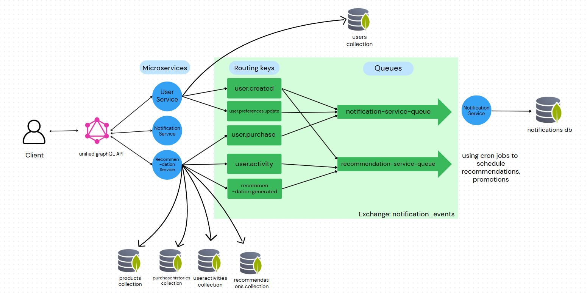

# 🛍️ E-Commerce Notification System

A microservices-based notification system for e-commerce platforms, enabling targeted and personalized notifications to users based on their preferences, behavior, and recommendations.

Project meant as a submission for assignment task for Backend Intern Role at Pratilipi

## 📋 Table of Contents

- [System Overview](#-system-overview)
- [Architecture](#-architecture)
- [Service Descriptions](#-service-descriptions)
- [Message Flow & RabbitMQ Configuration](#-message-flow--rabbitmq-configuration)
- [Notification Types & Triggers](#-notification-types--triggers)
- [Setup & Installation](#-setup--installation)
- [Environment Variables](#-environment-variables)
- [Development](#-development)
- [Troubleshooting](#-troubleshooting)

## 🔍 System Overview

This system provides a comprehensive notification infrastructure for e-commerce platforms, handling user preferences, personalized recommendations, and order updates. The architecture follows a microservices pattern with GraphQL Federation for seamless API integration.

## 🏗️ Architecture

The system is built on a microservices architecture with the following components:

```
┌─────────────┐      ┌──────────────────┐      ┌─────────────────────┐
│             │      │                  │      │                     │
│   Gateway   │◄────►│   User Service   │◄────►│ Recommendation      │
│             │      │                  │      │ Service             │
└──────┬──────┘      └────────┬─────────┘      └───────────┬─────────┘
       │                      │                            │
       │                      │                            │
       │                      ▼                            │
       │             ┌──────────────────┐                  │
       └────────────►│  Notification    │◄─────────────────┘
                     │  Service         │
                     └──────────────────┘
```

Communication between services happens through:
1. GraphQL federation for direct queries/mutations
2. RabbitMQ for asynchronous event-driven communication



## 🚀 Service Descriptions

### 🌐 API Gateway (Port 4000)

The Gateway service acts as the entry point for all client requests using Apollo Gateway with GraphQL Federation.

**Key Features:**
- Authentication and authorization middleware
- Request routing to appropriate microservices
- Response caching for improved performance
- Error handling and formatting

The gateway aggregates schemas from all services to provide a unified GraphQL API to clients.

### 👤 User Service (Port 4001)

Manages user accounts, authentication, and notification preferences.

**Key Features:**
- User registration and authentication
- JWT token generation and validation
- Management of notification preferences (email, push, SMS)
- User profile management
- Publishing user events to RabbitMQ

**Data Model:**
- User profiles with contact information
- Notification preferences per channel and type
- Authentication credentials

### 📣 Notification Service (Port 4002)

Central hub for processing and delivering notifications to users across different channels.

**Key Features:**
- Processes events from other services
- Generates appropriate notifications based on event type
- Tracks notification delivery and read status
- Provides notification history per user
- Respects user notification preferences

**Data Model:**
- Notification records with type, content, and status
- Delivery status tracking
- Notification templates

### 🔮 Recommendation Service (Port 4003)

Generates personalized product recommendations based on user behavior and preferences.

**Key Features:**
- Processes user activity data
- Generates product recommendations using algorithms
- Scheduled recommendation generation
- Publishing recommendation events to notification service

**Data Model:**
- Product catalog
- User activity/behavior data
- Generated recommendations with scores and reasoning

## 📨 Message Flow & RabbitMQ Configuration

### Exchange and Queue Configuration

The system uses a topic exchange named `notification_events` for all inter-service communication:

```
┌─────────────────────────┐
│                         │
│  notification_events    │
│  (topic exchange)       │
│                         │
└─┬───────────┬───────────┘
  │           │           │
  │           │           │
  ▼           ▼           ▼
┌─────┐    ┌─────┐    ┌─────┐
│Queue│    │Queue│    │Queue│
└─────┘    └─────┘    └─────┘
```

### Queue Bindings and Routing Keys

| Service | Queue Name | Binding Patterns (Routing Keys) |
|---------|------------|--------------------------------|
| User Service | user_service_queue | notification.sent |
| Notification Service | notification_service_queue | user.created<br>user.preferences.updated<br>recommendation.generated |
| Recommendation Service | recommendation_service_queue | user.created<br>user.preferences.updated<br>user.activity.tracked |

### Message Flow Scenarios

#### 1. New User Registration
- User Service publishes `user.created` event
- Notification Service consumes event, creates welcome notification
- Recommendation Service begins tracking the new user

#### 2. User Updates Preferences
- User Service publishes `user.preferences.updated` event
- Notification Service updates delivery settings
- Recommendation Service adjusts recommendation algorithm parameters

#### 3. Recommendation Generation
- Recommendation Service generates personalized recommendations
- Publishes `recommendation.generated` event
- Notification Service creates notifications for user based on preferences

#### 4. User Activity Tracking
- User actions (product views, purchases) tracked
- Recommendation Service consumes these events
- Updates recommendation algorithms accordingly

## 📝 Notification Types & Triggers

The system supports three primary notification types:

### 🏷️ Promotional Notifications

**Triggers:**
- System-initiated marketing campaigns
- Special offers or discounts
- Price drops on wish-listed items
- Seasonal promotions
- New user welcome message

**Example Content:**
- "Welcome to our platform, [User Name]! Explore our products and enjoy shopping."
- "Flash Sale: 30% off on electronics for the next 24 hours!"

### 📦 Order Update Notifications

**Triggers:**
- Order status changes (placed, processed, shipped, delivered)
- Delivery updates
- Return or refund status updates
- Payment confirmations
- Preference updates confirmation

**Example Content:**
- "Your order #12345 has been shipped! Expected delivery: June 15th."
- "Your notification preferences have been updated."

### 💡 Recommendation Notifications

**Triggers:**
- Personalized product recommendations based on:
  - Browsing history
  - Purchase history
  - Similar user preferences
  - Abandoned cart items
- New products in user's preferred categories
- Back-in-stock items from wishlist

**Example Content:**
- "Based on your recent purchases, you might like: [Product Name]"
- "Items similar to what you've been browsing are now on sale!"

## 🛠️ Setup & Installation

### Prerequisites
- Node.js v14+ and npm
- MongoDB
- RabbitMQ

### Installation Steps

1. Clone the repository:
   ```bash
   git clone https://github.com/yourusername/ecom-notifs.git
   cd ecom-notifs
   ```

2. Set up each service:
   ```bash
   # Gateway
   cd services/gateway
   npm install
   
   # User Service
   cd ../user-service
   npm install
   
   # Notification Service
   cd ../notification-service
   npm install
   
   # Recommendation Service
   cd ../recommendation-service
   npm install
   ```

3. Configure environment variables (see Environment Variables section)

4. Start the services:
   ```bash
   # Start MongoDB and RabbitMQ (using Docker)
   docker-compose up -d mongodb rabbitmq
   
   # Start each service (in separate terminals)
   cd services/gateway
   npm start
   
   cd services/user-service
   npm start
   
   cd services/notification-service
   npm start
   
   cd services/recommendation-service
   npm start
   ```

## 🔐 Environment Variables

Create `.env` files in each service directory with the following variables:

### Gateway Service
```
PORT=4000
NODE_ENV=development
JWT_SECRET=your_jwt_secret
```

### User Service
```
PORT=4001
MONGODB_URI=mongodb://localhost:27017/user-service
RABBITMQ_URI=amqp://localhost
JWT_SECRET=your_jwt_secret
```

### Notification Service
```
PORT=4002
MONGODB_URI=mongodb://localhost:27017/notification-service
RABBITMQ_URI=amqp://localhost
JWT_SECRET=your_jwt_secret
```

### Recommendation Service
```
PORT=4003
MONGODB_URI=mongodb://localhost:27017/recommendation-service
RABBITMQ_URI=amqp://localhost
JWT_SECRET=your_jwt_secret
GENERATE_MOCK_DATA=true
```

## 💻 Development

### Project Structure
```
services/
  ├── gateway/
  │   ├── src/
  │   │   ├── index.js        # Main entry point
  │   │   ├── config/         # Configuration files
  │   │   ├── middleware/     # Auth middleware
  │   │   ├── cache/          # Response caching
  │   │   └── utils/          # Utility functions
  │   └── package.json
  │
  ├── user-service/
  │   ├── src/
  │   │   ├── index.js        # Main entry point
  │   │   ├── config/         # DB and RabbitMQ configuration
  │   │   ├── graphql/        # Schema and resolvers
  │   │   ├── models/         # Mongoose models
  │   │   ├── queue/          # RabbitMQ producers/consumers
  │   │   └── middleware/     # Auth middleware
  │   └── package.json
  │
  ├── notification-service/
  │   ├── src/
  │   │   ├── index.js        # Main entry point
  │   │   ├── config/         # Configuration files
  │   │   ├── controllers/    # Notification controllers
  │   │   ├── graphql/        # Schema and resolvers
  │   │   ├── models/         # Mongoose models
  │   │   ├── queue/          # RabbitMQ producers/consumers
  │   │   └── utils/          # Utility functions
  │   └── package.json
  │
  └── recommendation-service/
      ├── src/
      │   ├── index.js        # Main entry point
      │   ├── algorithms/     # Recommendation algorithms
      │   ├── config/         # Configuration files
      │   ├── graphql/        # Schema and resolvers
      │   ├── models/         # Mongoose models
      │   ├── queue/          # RabbitMQ producers/consumers
      │   ├── schedulers/     # Scheduled jobs
      │   └── utils/          # Utility functions
      └── package.json
```

### API Examples

#### GraphQL Queries

```graphql
# Get user notifications
query {
  me {
    notifications(limit: 10) {
      id
      type
      content
      createdAt
      read
    }
  }
}

# Update notification preferences
mutation {
  updateNotificationPreferences(
    preferences: {
      email: true
      push: true
      recommendations: true
      orderUpdates: true
      promotions: false
    }
  ) {
    success
    message
  }
}
```

## 🛑 Troubleshooting

### Common Issues

#### Services Unable to Connect to RabbitMQ
- Verify RabbitMQ is running: `docker ps | grep rabbitmq`
- Check connection URL in environment variables
- Ensure firewall allows connections to RabbitMQ port

#### GraphQL Federation Errors
- Ensure all subgraphs are running and accessible to the gateway
- Check that service `typeDefs` include proper federation directives
- Verify consistent schema across services

#### Authentication Issues
- Confirm JWT_SECRET is consistent across all services 
- Check token expiration and validation logic
- Verify auth headers are properly forwarded by the gateway

#### Missing Notifications
- Check RabbitMQ queue bindings and routing keys
- Ensure consumer services are properly reading messages
- Verify notification preferences for the user
